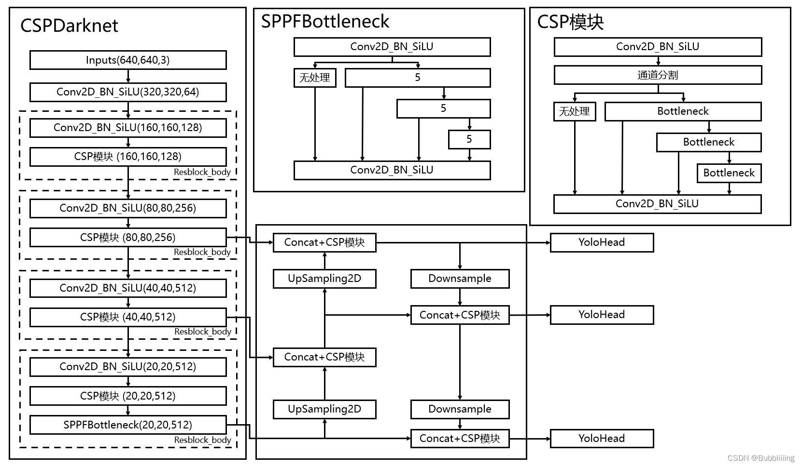
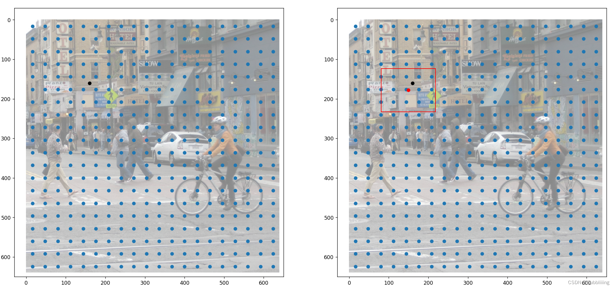

[睿智的目标检测66——Pytorch搭建YoloV8目标检测平台_Bubbliiiing的博客-CSDN博客](https://blog.csdn.net/weixin_44791964/article/details/129978504)

# 源码下载

https://github.com/bubbliiiing/yolov8-pytorch

喜欢的可以点个star噢。

# YoloV8改进的部分（不完全）

**很多细节与YoloV7关系并不大，大概不是同一组人开发的原因。**

1. **主干部分：与此前的YoloV5系列差距不大，不过相比之前第一次卷积的卷积核缩小了，是3而不是6。另外CSP模块的预处理从三次卷积换成了两次卷积，具体的实现方式是第一次卷积的通道数扩充为原来的两倍，然后将卷积结果在通道上对半分割。另外借鉴了YoloV7的多堆叠结构。**

2. **加强特征提取部分：不再对主干网络获得的特征层进行卷积（目的估计是加快速度），另外CSP模块的预处理从三次卷积换成了两次卷积，实现方式与主干网络一样。**

3. **预测头：加入了DFL模块，DFL模块简单理解就是以概率的方式获得回归值，比如我们当前设置DFL的长度为8，那么某个回归值的计算方式为：**

| 预测结果取softmax | 0.0  | 0.1  | 0.0  | 0.0  | 0.4  | 0.5  | 0.0  | 0.0  | 点乘                              |
| ----------------- | ---- | ---- | ---- | ---- | ---- | ---- | ---- | ---- | --------------------------------- |
| 参考的固定值      | 0    | 1    | 2    | 3    | 4    | 5    | 6    | 7    | 0.1 * 1 + 0.4 * 4 + 0.5 * 5 = 4.2 |

也就是预测的概率和range(0,8)进行点乘，获得回归值。在YoloV8中，DFL的长度为16，一共有四个需要回归的目标，所以回归头的通道为 $16  \times 4 = 64$。

4. **自适应多正样本匹配：在YoloV8中，参考YoloX使用了无anchors的实现，是一个无锚点算法，面对长宽不规则的目标比较有优势；在计算损失进行正样本匹配时，正样本需要满足两个条件：一是在真实框内、二是真实框topk最符合要求的正样本（预测框与真实框重合度高且种类预测准确）。**

**以上并非全部的改进部分，还存在一些其它的改进，这里只列出来了一些我比较感兴趣，而且非常有效的改进。**

# YoloV8实现思路

## 一、整体结构解析



在学习YoloV8之前，我们需要对YoloV8所作的工作有一定的了解，这有助于我们后面去了解网络的细节，YoloV8在预测方式上与之前的Yolo并没有多大的差别，依然分为三个部分。

**分别是Backbone，FPN以及Yolo Head**。

**Backbone是YoloV8的主干特征提取网络**，输入的图片首先会在主干网络里面进行**特征提取**，提取到的特征可以被称作特征层，**是输入图片的特征集合**。在主干部分，我们**获取了三个特征层**进行下一步网络的构建，这三个特征层我称它为**有效特征层**。

**FPN是YoloV8的加强特征提取网络**，在主干部分获得的三个**有效特征层**会在这一部分进行特征融合，特征融合的目的是结合不同尺度的特征信息。在FPN部分，已经获得的**有效特征层**被用于继续提取特征。**在YoloV8里依然使用到了Panet的结构，我们不仅会对特征进行上采样实现特征融合，还会对特征再次进行下采样实现特征融合。**

**Yolo Head是YoloV8的分类器与回归器**，通过Backbone和FPN，我们已经可以获得三个加强过的有效特征层。每一个特征层都有宽、高和通道数，此时我们可以将**特征图看作一个又一个特征点的集合**，每个特征点作为先验点，而不再存在先验框，**每一个先验点都有通道数个特征**。Yolo Head实际上所做的工作就是**对特征点进行判断**，判断**特征点上的先验框是否有物体与其对应**。YoloV8所用的解耦头是分开的，也就是分类和回归不在一个1X1卷积里实现。

判断**特征点上的先验框是否有物体与其对应**。YoloV8所用的解耦头是分开的，也就是分类和回归不在一个1X1卷积里实现。

因此，整个YoloV8网络所作的工作依然就是 **特征提取-特征加强-预测先验框对应的物体情况**。

## 二、网络结构解析

### 1、主干网络Backbone介绍


YoloV8所使用的主干特征提取网络主要为速度快做了一些优化：

1、颈部结构使用普通的步长为2的3x3卷积。

此前：

**YoloV5最初使用了Focus结构来初步提取特征，在改进后使用了大卷积核的卷积来初步提取特征，速度都不快。**

**YoloV7则使用了三次卷积来初步提取特征，速度也不快。**

YoloV8则使用普通的步长为2的3x3卷积核来初步提取特征（估计是感受野够了）。

```python
self.stem = Conv(3, base_channels, 3, 2)
```

2、CSP模块的预处理从三次卷积换成了两次卷积，并且借鉴了YoloV7的多堆叠结构。

具体的实现方式是第一次卷积的通道数扩充为原来的两倍，然后将卷积结果在通道上对半分割，这样可以减少一次卷积的次数，加快网络的速度。


实现代码如下：

```python
#-----------------------------------------------#
#                  in
#                   │
#                cv1(1x1)
#                   │
#          ┌──────split──────┐
#          │                 ├─────────┐
#          │                 │  m_1(Bottleneck)
#          │                 │         ├────────┐
#          │                 │         │ m_2(Bottleneck)
#          │                 │         │        ├ ─ ─ ─ ─ ┐
#          │                 │         │        │  m_3(Bottleneck)...
#          └─────concat──────┴─────────┴────────┘─ ─ ─ ─ ─┘
#                   │
#                cv2(1X1)
#                   │
#                  out
#-----------------------------------------------#
class C2f(nn.Module):
    # CSPNet结构结构，大残差结构
    # c1为输入通道数，c2为输出通道数
    def __init__(self, c1, c2, n=1, shortcut=False, g=1, e=0.5):
        super().__init__()
        self.c      = int(c2 * e)
        self.cv1    = Conv(c1, 2 * self.c, 1, 1)
        self.cv2    = Conv((2 + n) * self.c, c2, 1)
        self.m      = nn.ModuleList(Bottleneck(self.c, self.c, shortcut, g, k=((3, 3), (3, 3)), e=1.0) for _ in range(n))

    def forward(self, x):
        # 进行一个卷积，然后划分成两份，每个通道都为c
        y = list(self.cv1(x).split((self.c, self.c), 1))
        # 每进行一次残差结构都保留，然后堆叠在一起，密集残差
        y.extend(m(y[-1]) for m in self.m)
        return self.cv2(torch.cat(y, 1))
```

整个主干实现代码为：

```python
import torch
import torch.nn as nn


def autopad(k, p=None, d=1):
    # kernel, padding, dilation
    # 对输入的特征层进行自动padding，按照Same原则
    if d > 1:
        # actual kernel-size
        k = d * (k - 1) + 1 if isinstance(k, int) else [d * (x - 1) + 1 for x in k]
    if p is None:
        # auto-pad
        p = k // 2 if isinstance(k, int) else [x // 2 for x in k]
    return p

class SiLU(nn.Module):
    # SiLU激活函数
    @staticmethod
    def forward(x):
        return x * torch.sigmoid(x)

class Conv(nn.Module):
    # 标准卷积+标准化+激活函数
    default_act = SiLU()
    def __init__(self, c1, c2, k=1, s=1, p=None, g=1, d=1, act=True):
        super().__init__()
        self.conv   = nn.Conv2d(c1, c2, k, s, autopad(k, p, d), groups=g, dilation=d, bias=False)
        self.bn     = nn.BatchNorm2d(c2, eps=0.001, momentum=0.03, affine=True, track_running_stats=True)
        self.act    = self.default_act if act is True else act if isinstance(act, nn.Module) else nn.Identity()

    def forward(self, x):
        return self.act(self.bn(self.conv(x)))

    def forward_fuse(self, x):
        return self.act(self.conv(x))

class Bottleneck(nn.Module):
    # 标准瓶颈结构，残差结构
    # c1为输入通道数，c2为输出通道数
    def __init__(self, c1, c2, shortcut=True, g=1, k=(3, 3), e=0.5):
        super().__init__()
        c_ = int(c2 * e)  # hidden channels
        self.cv1 = Conv(c1, c_, k[0], 1)
        self.cv2 = Conv(c_, c2, k[1], 1, g=g)
        self.add = shortcut and c1 == c2

    def forward(self, x):
        return x + self.cv2(self.cv1(x)) if self.add else self.cv2(self.cv1(x))

#-----------------------------------------------#
#                  in
#                   │
#                cv1(1x1)
#                   │
#          ┌──────split──────┐
#          │                 ├─────────┐
#          │                 │  m_1(Bottleneck)
#          │                 │         ├────────┐
#          │                 │         │ m_2(Bottleneck)
#          │                 │         │        ├ ─ ─ ─ ─ ┐
#          │                 │         │        │  m_3(Bottleneck)...
#          └─────concat──────┴─────────┴────────┘─ ─ ─ ─ ─┘
#                   │
#                cv2(1X1)
#                   │
#                  out
#-----------------------------------------------#
class C2f(nn.Module):
    # CSPNet结构结构，大残差结构
    # c1为输入通道数，c2为输出通道数
    def __init__(self, c1, c2, n=1, shortcut=False, g=1, e=0.5):
        super().__init__()
        self.c      = int(c2 * e)
        self.cv1    = Conv(c1, 2 * self.c, 1, 1)
        self.cv2    = Conv((2 + n) * self.c, c2, 1)
        self.m      = nn.ModuleList(Bottleneck(self.c, self.c, shortcut, g, k=((3, 3), (3, 3)), e=1.0) for _ in range(n))

    def forward(self, x):
        # 进行一个卷积，然后划分成两份，每个通道都为c
        y = list(self.cv1(x).split((self.c, self.c), 1))
        # 每进行一次残差结构都保留，然后堆叠在一起，密集残差
        y.extend(m(y[-1]) for m in self.m)
        return self.cv2(torch.cat(y, 1))

#-----------------------------------------------#
#   SPP
#               in
#                │
#             cv1(1x1)
#                │
#          ┌─────┴─────┐
#          │      MaxPool2d(5x5)
#          │           ├───────┐
#          │           │  MaxPool2d(5x5) 等价9x9
#          │           │       ├───────┐
#          │           │       │  MaxPool2d(5x5) 等价13x13
#          └───concat──┴───────┴───────┘
#                │
#             cv2(1x1)
#                │
#               out
#-----------------------------------------------#
class SPPF(nn.Module):
    # SPP结构，5、9、13最大池化核的最大池化。
    def __init__(self, c1, c2, k=5):
        super().__init__()
        c_          = c1 // 2
        # 1x1Conv缩减通道
        self.cv1    = Conv(c1, c_, 1, 1)
        # 1x1Conv调整最终通道
        self.cv2    = Conv(c_ * 4, c2, 1, 1)
        self.m      = nn.MaxPool2d(kernel_size=k, stride=1, padding=k // 2)

    def forward(self, x):
        x = self.cv1(x)
        y1 = self.m(x)
        y2 = self.m(y1)
        return self.cv2(torch.cat((x, y1, y2, self.m(y2)), 1))

class Backbone(nn.Module):
    def __init__(self, base_channels, base_depth, deep_mul, phi, pretrained=False):
        super().__init__()
        #-----------------------------------------------#
        #   输入图片是3, 640, 640
        #-----------------------------------------------#
        # 3, 640, 640 => 32, 640, 640 => 64, 320, 320
        self.stem = Conv(3, base_channels, 3, 2)

        # 64, 320, 320 => 128, 160, 160 => 128, 160, 160
        self.dark2 = nn.Sequential(
            Conv(base_channels, base_channels * 2, 3, 2),
            C2f(base_channels * 2, base_channels * 2, base_depth, True),
        )
        # 128, 160, 160 => 256, 80, 80 => 256, 80, 80
        self.dark3 = nn.Sequential(
            Conv(base_channels * 2, base_channels * 4, 3, 2),
            C2f(base_channels * 4, base_channels * 4, base_depth * 2, True),
        )
        # 256, 80, 80 => 512, 40, 40 => 512, 40, 40
        self.dark4 = nn.Sequential(
            Conv(base_channels * 4, base_channels * 8, 3, 2),
            C2f(base_channels * 8, base_channels * 8, base_depth * 2, True),
        )
        # 512, 40, 40 => 1024 * deep_mul, 20, 20 => 1024 * deep_mul, 20, 20
        self.dark5 = nn.Sequential(
            Conv(base_channels * 8, int(base_channels * 16 * deep_mul), 3, 2),
            C2f(int(base_channels * 16 * deep_mul), int(base_channels * 16 * deep_mul), base_depth, True),
            SPPF(int(base_channels * 16 * deep_mul), int(base_channels * 16 * deep_mul), k=5)
        )

        if pretrained:
            url = {
                "n" : 'https://github.com/bubbliiiing/yolov8-pytorch/releases/download/v1.0/yolov8_n_backbone_weights.pth',
                "s" : 'https://github.com/bubbliiiing/yolov8-pytorch/releases/download/v1.0/yolov8_s_backbone_weights.pth',
                "m" : 'https://github.com/bubbliiiing/yolov8-pytorch/releases/download/v1.0/yolov8_m_backbone_weights.pth',
                "l" : 'https://github.com/bubbliiiing/yolov8-pytorch/releases/download/v1.0/yolov8_l_backbone_weights.pth',
                "x" : 'https://github.com/bubbliiiing/yolov8-pytorch/releases/download/v1.0/yolov8_x_backbone_weights.pth',
            }[phi]
            checkpoint = torch.hub.load_state_dict_from_url(url=url, map_location="cpu", model_dir="./model_data")
            self.load_state_dict(checkpoint, strict=False)
            print("Load weights from " + url.split('/')[-1])

    def forward(self, x):
        x = self.stem(x)
        x = self.dark2(x)
        #-----------------------------------------------#
        #   dark3的输出为256, 80, 80，是一个有效特征层
        #-----------------------------------------------#
        x = self.dark3(x)
        feat1 = x
        #-----------------------------------------------#
        #   dark4的输出为512, 40, 40，是一个有效特征层
        #-----------------------------------------------#
        x = self.dark4(x)
        feat2 = x
        #-----------------------------------------------#
        #   dark5的输出为1024 * deep_mul, 20, 20，是一个有效特征层
        #-----------------------------------------------#
        x = self.dark5(x)
        feat3 = x

        #-----------------------------------------------#
        #   feat1: 256, 80, 80
        #   feat2: 512, 40, 40
        #   feat3: 1024 * deep_mul, 20, 20
        #-----------------------------------------------#
        return feat1, feat2, feat3


if __name__ == "__main__":
    phi = "x"
    depth_dict          = {'n' : 0.33, 's' : 0.33, 'm' : 0.67, 'l' : 1.00, 'x' : 1.00,}
    width_dict          = {'n' : 0.25, 's' : 0.50, 'm' : 0.75, 'l' : 1.00, 'x' : 1.25,}
    deep_width_dict     = {'n' : 1.00, 's' : 1.00, 'm' : 0.75, 'l' : 0.50, 'x' : 0.50,}
    dep_mul, wid_mul, deep_mul = depth_dict[phi], width_dict[phi], deep_width_dict[phi]

    base_channels       = int(wid_mul * 64)  # 64
    base_depth          = max(round(dep_mul * 3), 1)  # 3

    model = Backbone(base_channels, base_depth, deep_mul, phi, pretrained=False)
    x = torch.ones(1, 3, 640, 640)

    model.eval()
    with torch.inference_mode():
        feats = model(x)
    for feat in feats:
        print(feat.size())

    if False:
        onnx_path = "backbone-x.onnx"
        torch.onnx.export(model,
                          x,
                          onnx_path,
                          input_names=['image'],
                         )
        import onnx
        from onnxsim import simplify

        # 载入onnx模型
        model_ = onnx.load(onnx_path)

        # 简化模型
        model_simple, check = simplify(model_)
        assert check, "Simplified ONNX model could not be validated"
        onnx.save(model_simple, onnx_path)
        print('finished exporting ' + onnx_path)
```

### 2、构建FPN特征金字塔进行加强特征提取


在特征利用部分，YoloV8提取**多特征层进行目标检测**，一共**提取三个特征层**。

三个特征层位于主干部分的不同位置，分别位于**中间层，中下层，底层**，当输入为(640,640,3)的时候，三个特征层的**shape分别为feat1=(80,80,256)、feat2=(40,40,512)、feat3=(20,20,1024 \* deep_mul)**。

**deep_mul只是个系数，对深层的通道进行缩放，在YoloV8中应该是为了平衡计算量做的考虑。**

在获得三个有效特征层后，我们利用这三个有效特征层进行FPN层的构建，构建方式为（在本博文中，将SPPCSPC结构归于FPN中）：

1. 在获得三个有效特征层后，我们利用这三个有效特征层进行FPN层的构建，构建方式为（在本博文中，将SPPCSPC结构归于FPN中）：

2. **P4=(40,40,512)进行上采样UmSampling2d后与feat1=(80,80,256)特征层进行结合**，然后使用CSP模块进行特征提取获得P3，此时获得的特征层为(80,80,256)。
3. P3=(80,80,256)的特征层进行一次3x3卷积进行下采样，**下采样后与P4堆叠**，然后使用CSP模块进行特征提取获得新P4，此时获得的特征层为(40,40,512)。
4. P4=(40,40,512)的特征层进行一次3x3卷积进行下采样，**下采样后与P5堆叠**，然后使用CSP模块进行特征提取获得新P5，此时获得的特征层为(20,20,1024 * deep_mul)。

特征金字塔可以将**不同shape的特征层进行特征融合**，有利于**提取出更好的特征**。

```python
class YoloBody(nn.Module):
    def __init__(self, input_shape, num_classes, phi, pretrained=False):
        super(YoloBody, self).__init__()
        self.phi = phi
        if phi in ['n', 's', 'm', 'l', 'x']:
            depth_dict          = {'n' : 0.33, 's' : 0.33, 'm' : 0.67, 'l' : 1.00, 'x' : 1.00,}
            width_dict          = {'n' : 0.25, 's' : 0.50, 'm' : 0.75, 'l' : 1.00, 'x' : 1.25,}
            deep_width_dict     = {'n' : 1.00, 's' : 1.00, 'm' : 0.75, 'l' : 0.50, 'x' : 0.50,}
            dep_mul, wid_mul, deep_mul = depth_dict[phi], width_dict[phi], deep_width_dict[phi]

            base_channels       = int(wid_mul * 64)          # 64
            base_depth          = max(round(dep_mul * 3), 1) # 3
            #-----------------------------------------------#
            #   输入图片是3, 640, 640
            #-----------------------------------------------#

            #-----------------------------------------------#
            #   生成主干模型
            #   获得三个有效特征层，他们的shape分别是：
            #   [B, 256, 80, 80]
            #   [B, 512, 40, 40]
            #   [B, 1024 * deep_mul, 20, 20]
            #-----------------------------------------------#
            self.backbone   = Backbone(base_channels, base_depth, deep_mul, phi, pretrained=pretrained)

        elif 'swin' in phi or 'convnext' in phi:
            dep_mul, wid_mul, deep_mul = 1.00, 1.25, 0.50 # 使用x大小的参数

            base_channels   = int(wid_mul * 64)          # 64
            base_depth      = max(round(dep_mul * 3), 1) # 3
            #-----------------------------------------------#
            #   输入图片是3, 640, 640
            #-----------------------------------------------#
            if 'swin' in phi:
                self.backbone = Swin(variance=phi, pretrained=pretrained)
            elif 'convnext' in phi:
                self.backbone = ConvNeXt(variance=phi, pretrained=pretrained)
            feat1_in        = {'swin_t' : 192, 'swin_s' : 192, 'swin_b' : 256,  'swin_v2_t' : 192, 'swin_v2_s' : 192, 'swin_v2_b' : 256,
                               'convnext_tiny' : 192, 'convnext_small' : 192, 'convnext_base' : 256,  'convnext_large' : 384,}[phi]
            feat2_in        = {'swin_t' : 384, 'swin_s' : 384, 'swin_b' : 512,  'swin_v2_t' : 384, 'swin_v2_s' : 384, 'swin_v2_b' : 512,
                               'convnext_tiny' : 384, 'convnext_small' : 384, 'convnext_base' : 512,  'convnext_large' : 768,}[phi]
            feat3_in        = {'swin_t' : 768, 'swin_s' : 768, 'swin_b' : 1024, 'swin_v2_t' : 768, 'swin_v2_s' : 768, 'swin_v2_b' : 1024,
                               'convnext_tiny' : 768, 'convnext_small' : 768, 'convnext_base' : 1024, 'convnext_large' : 1536,}[phi]
            # 调整输出channel到符合PANet的输入channel
            self.for_feat1  = nn.Conv2d(feat1_in, base_channels * 4,  1)
            self.for_feat2  = nn.Conv2d(feat2_in, base_channels * 8,  1)
            self.for_feat3  = nn.Conv2d(feat3_in, int(base_channels * 16 * deep_mul), 1)

        #------------------------加强特征提取网络------------------------#
        self.upsample   = nn.Upsample(scale_factor=2, mode="nearest")

        # [B, 1024 * deep_mul] + [B, 512, 40, 40] => [B, 512, 40, 40]
        self.conv3_for_upsample1    = C2f(int(base_channels * 16 * deep_mul) + base_channels * 8, base_channels * 8, base_depth, shortcut=False)
        # [B, 768, 80, 80] => [B, 256, 80, 80]
        self.conv3_for_upsample2    = C2f(base_channels * 8 + base_channels * 4, base_channels * 4, base_depth, shortcut=False)

        # [B, 256, 80, 80] => [B, 256, 40, 40]
        self.down_sample1           = Conv(base_channels * 4, base_channels * 4, 3, 2)
        # [B, 512 + 256, 40, 40] => [B, 512, 40, 40]
        self.conv3_for_downsample1  = C2f(base_channels * 8 + base_channels * 4, base_channels * 8, base_depth, shortcut=False)

        # [B, 512, 40, 40] => [B, 512, 20, 20]
        self.down_sample2           = Conv(base_channels * 8, base_channels * 8, 3, 2)
        # [B, 1024 * deep_mul] + [B, 512, 20, 20] =>  [B, 1024 * deep_mul, 20, 20]
        self.conv3_for_downsample2  = C2f(int(base_channels * 16 * deep_mul) + base_channels * 8, int(base_channels * 16 * deep_mul), base_depth, shortcut=False)
        #------------------------加强特征提取网络------------------------#

        ch              = [base_channels * 4, base_channels * 8, int(base_channels * 16 * deep_mul)]
        self.shape      = None
        self.nl         = len(ch)
        # self.stride     = torch.zeros(self.nl)
        self.stride     = torch.tensor([256 / x.shape[-2] for x in self.backbone.forward(torch.zeros(1, 3, 256, 256))])  # forward
        self.reg_max    = 16  # DFL channels (ch[0] // 16 to scale 4/8/12/16/20 for n/s/m/l/x)
        self.no         = num_classes + self.reg_max * 4  # number of outputs per anchor
        self.num_classes = num_classes

        c2, c3   = max((16, ch[0] // 4, self.reg_max * 4)), max(ch[0], num_classes)  # channels
        # box => [B, 4 * reg_max, 80/40/20, 80/40/20]
        self.cv2 = nn.ModuleList(nn.Sequential(Conv(x, c2, 3), Conv(c2, c2, 3), nn.Conv2d(c2, 4 * self.reg_max, 1)) for x in ch)
        # cls => [B, num_classes, 80/40/20, 80/40/20]
        self.cv3 = nn.ModuleList(nn.Sequential(Conv(x, c3, 3), Conv(c3, c3, 3), nn.Conv2d(c3, num_classes, 1)) for x in ch)
        if not pretrained:
            weights_init(self)
        # box [B, 4 * reg_max, 8400] => [B, 4, 8400]
        self.dfl = DFL(self.reg_max) if self.reg_max > 1 else nn.Identity()

    def fuse(self):
        print('Fusing layers... ')
        for m in self.modules():
            if type(m) is Conv and hasattr(m, 'bn'):
                m.conv = fuse_conv_and_bn(m.conv, m.bn)  # update conv
                delattr(m, 'bn')  # remove batchnorm
                m.forward = m.forward_fuse  # update forward
        return self

    def forward(self, x):
        #---------------------------------------------------#
        #   backbone
        #   获得三个有效特征层，他们的shape分别是：
        #   feat1: [B, 256, 80, 80]
        #   feat2: [B, 512, 40, 40]
        #   feat3: [B, 1024 * deep_mul, 20, 20]
        #---------------------------------------------------#
        feat1, feat2, feat3 = self.backbone(x)
        if self.phi not in ['n', 's', 'm', 'l', 'x']:
            feat1 = self.for_feat1(feat1)
            feat2 = self.for_feat2(feat2)
            feat3 = self.for_feat3(feat3)

        #------------------------加强特征提取网络------------------------#
        # [B, 1024 * deep_mul, 20, 20] => [B, 1024 * deep_mul, 40, 40]
        P5_upsample = self.upsample(feat3)
        # [B, 1024 * deep_mul, 40, 40] cat [B, 512, 40, 40] => [B, 1024 * deep_mul + 512, 40, 40]
        P4          = torch.cat([P5_upsample, feat2], 1)
        # [B, 1024 * deep_mul + [512, 40, 40] =>[B, 512, 40, 40]
        P4          = self.conv3_for_upsample1(P4)

        # [B, 512, 40, 40] => [B, 512, 80, 80]
        P4_upsample = self.upsample(P4)
        # [B, 512, 80, 80] cat [B, 256, 80, 80] => [B, 768, 80, 80]
        P3          = torch.cat([P4_upsample, feat1], 1)
        # [B, 768, 80, 80] => [B, 256, 80, 80]
        P3_out      = self.conv3_for_upsample2(P3)

        # [B, 256, 80, 80] => [B, 256, 40, 40]
        P3_downsample = self.down_sample1(P3_out)
        # [B, 512, 40, 40] cat [B, 256, 40, 40] => [B, 768, 40, 40]
        P4 = torch.cat([P3_downsample, P4], 1)
        # [B, 768, 40, 40] => [B, 512, 40, 40]
        P4_out = self.conv3_for_downsample1(P4)

        # [B, 512, 40, 40] => [B, 512, 20, 20]
        P4_downsample = self.down_sample2(P4_out)
        # [B, 512, 20, 20] cat [B, 1024 * deep_mul, 20, 20] => [B, 1024 * deep_mul + 512, 20, 20]
        P5 = torch.cat([P4_downsample, feat3], 1)
        # [B, 1024 * deep_mul + 512, 20, 20] => [B, 1024 * deep_mul, 20, 20]
        P5_out = self.conv3_for_downsample2(P5)
        #------------------------加强特征提取网络------------------------#
        # P3_out [B, 256, 80, 80]
        # P4_out [B, 512, 40, 40]
        # P5_out [B, 1024 * deep_mul, 20, 20]
        shape = P3_out.shape  # BCHW

        # 将每层的box和cls输出拼接起来
        # P3_out [B, 256, 80, 80]             => [B, 4 * reg_max + num_classes, 80, 80]
        # P4_out [B, 512, 40, 40]             => [B, 4 * reg_max + num_classes, 40, 40]
        # P5_out [B, 1024 * deep_mul, 20, 20] => [B, 4 * reg_max + num_classes, 20, 20]
        x = [P3_out, P4_out, P5_out]
        for i in range(self.nl):
            # cv2: box => [B, 4 * reg_max, 80, 80]
            # cv3: cls => [B, num_classes, 80, 80]
            x[i] = torch.cat((self.cv2[i](x[i]), self.cv3[i](x[i])), 1)

        if self.shape != shape:
            self.anchors, self.strides = (x.transpose(0, 1) for x in make_anchors(x, self.stride, 0.5))
            self.shape = shape

        # 将不同层的box和cls分别拼接到一起
        # [B, 4 * reg_max + num_classes, 80, 80] => [B, 4 * reg_max + num_classes, 80*80] ───┐
        # [B, 4 * reg_max + num_classes, 40, 40] => [B, 4 * reg_max + num_classes, 40*40] ─ cat => [B, 4 * reg_max + num_classes, 8400]
        # [B, 4 * reg_max + num_classes, 20, 20] => [B, 4 * reg_max + num_classes, 20*20] ───┘
        # 依次取出每层的输出,然后在最后维度拼接,之后在第1个维度分离出box和cls
        # [B, 4 * reg_max + num_classes, 8400] split [B, 4 * reg_max, 8400] : box
        #                                            [B, num_classes, 8400] : cls
        box, cls        = torch.cat([xi.view(shape[0], self.no, -1) for xi in x], 2).split((self.reg_max * 4, self.num_classes), 1)
        # origin_cls      = [xi.split((self.reg_max * 4, self.num_classes), 1)[1] for xi in x]

        # 对box做DFL处理,获取位置的4个回归值
        # [B, 4 * reg_max, 8400] => [B, 4, 8400]
        dbox            = self.dfl(box)

        #-------------------------------------------------------------------------------------------#
        #   dbox:    [B, 4, 8400]           box detect
        #   cls:     [B, num_classes, 8400] cls detect
        #   x:       [[B, 144, 80, 80], [B, 144, 40, 40], [B, 144, 20, 20]]   [P3_out, P4_out, P5_out]
        #   anchors: [2, 8400]
        #   strides: [1, 8400]
        #-------------------------------------------------------------------------------------------#
        return dbox, cls, x, self.anchors.to(dbox.device), self.strides.to(dbox.device)
```

### 3、利用Yolo Head获得预测结果


利用FPN特征金字塔，**我们可以获得三个加强特征，这三个加强特征的shape分别为(20,20,1024 * deep_mul)、(40,40,512)、(80,80,256)，然后我们利用这三个shape的特征层传入Yolo Head获得预测结果，YoloV8使用了解耦头，并且使用了DFL技术。**

与之前Yolo系列不同的是，YoloV8在Yolo Head后使用了一个DFL结构来计算回归值，而不是直接获得回归值，**DFL模块简单理解就是以概率的方式获得回归值，比如我们当前设置DFL的长度为8，那么某个回归值的计算方式为：**

| 预测结果取softmax | 0.0  | 0.1  | 0.0  | 0.0  | 0.4  | 0.5  | 0.0  | 0.0  | 点乘                              |
| ----------------- | ---- | ---- | ---- | ---- | ---- | ---- | ---- | ---- | --------------------------------- |
| 参考的固定值      | 0    | 1    | 2    | 3    | 4    | 5    | 6    | 7    | 0.1 * 1 + 0.4 * 4 + 0.5 * 5 = 4.2 |

而对于每一个特征层，我们可以获得利用两个独立的卷积调整通道数，分别获得每个特征点目标对应预测框的种类和回归值，**回归值相关的预测头的通道数与DFL的长度有关，在YoloV8中，DFL的长度均设为16，种类相关的预测头的通道数和需要区分的种类个数相关**。

无论使用什么数据集，回归值相关的预测头的通道数均为 $16\times4=64$ ，三个特征层的shape为 (**20,20,64**)，(**40,40,64**)，(**80,80,64**)。64可以分为四个16，用于计算四个回归系数。计算完回归系数后。三个特征层的特征层的shape为(**20,20,4**)，(**40,40,4**)，(**80,80,4**) **(location x1y1x2y2)**

**如果使用的是voc训练集，类则为20种，种类相关的预测头的通道数为20**，三个特征层的shape为(**20,20,20**)，(**40,40,20**)，(**80,80,20**)。用于判断每一个特征点所包含的物体种类。

**如果使用的是coco训练集，类则为80种，种类相关的预测头的通道数为80**，三个特征层的shape为(**20,20,80**)，(**40,40,80**)，(**80,80,80**)。用于判断每一个特征点所包含的物体种类。

实现代码如下：

```python
import numpy as np
import torch
import torch.nn as nn
import sys
sys.path.append("../")

from nets.backbone import Backbone, C2f, Conv
from nets.yolo_training import weights_init
from nets.swin import Swin
from nets.convnext import ConvNeXt
from utils.utils_bbox import make_anchors

def fuse_conv_and_bn(conv, bn):
    # 混合Conv2d + BatchNorm2d 减少计算量
    # Fuse Conv2d() and BatchNorm2d() layers https://tehnokv.com/posts/fusing-batchnorm-and-conv/
    fusedconv = nn.Conv2d(conv.in_channels,
                          conv.out_channels,
                          kernel_size=conv.kernel_size,
                          stride=conv.stride,
                          padding=conv.padding,
                          dilation=conv.dilation,
                          groups=conv.groups,
                          bias=True).requires_grad_(False).to(conv.weight.device)

    # 准备kernel
    w_conv = conv.weight.clone().view(conv.out_channels, -1)
    w_bn = torch.diag(bn.weight.div(torch.sqrt(bn.eps + bn.running_var)))
    fusedconv.weight.copy_(torch.mm(w_bn, w_conv).view(fusedconv.weight.shape))

    # 准备bias
    b_conv = torch.zeros(conv.weight.size(0), device=conv.weight.device) if conv.bias is None else conv.bias
    b_bn = bn.bias - bn.weight.mul(bn.running_mean).div(torch.sqrt(bn.running_var + bn.eps))
    fusedconv.bias.copy_(torch.mm(w_bn, b_conv.reshape(-1, 1)).reshape(-1) + b_bn)

    return fusedconv

class DFL(nn.Module):
    """
    DFL模块
    Distribution Focal Loss (DFL) proposed in Generalized Focal Loss https://ieeexplore.ieee.org/document/9792391 https://arxiv.org/abs/2006.04388
    使用卷积的操作进行相乘和相加

    预测结果取softmax   0.0	 0.1  0.0  0.0  0.4  0.5  0.0  0.0
    参考的固定值         0    1    2    3    4    5    6    7   conv中的权重
    点乘               0.1 * 1 + 0.4 * 4 + 0.5 * 5 = 4.2
    """
    def __init__(self, c1=16):
        super().__init__()
        #-----------------------------------------------------#
        #   不训练这个conv,权重设置为 [0...15], 直接和预测值相乘
        #   out_channels = 1,含义为计算结果channel为1
        #-----------------------------------------------------#
        self.conv   = nn.Conv2d(c1, 1, 1, bias=False).requires_grad_(False)
        x           = torch.arange(c1, dtype=torch.float)
        self.conv.weight.data[:] = nn.Parameter(x.view(1, c1, 1, 1))    # 权重设置为 [0...15]
        self.c1     = c1

    def forward(self, x):
        # [B, 4 * c1, 8400]
        b, c, a = x.shape     # view                transpose           softmax             conv               view
        # [B, 4 * c1, 8400] => [B, 4, c1, 8400] => [B, c1, 4, 8400] => [B, c1, 4, 8400] => [B, 1, 4, 8400] => [B, 4, 8400]
        # 以softmax的方式，对0~16的数字计算百分比，获得最终数字。
        return self.conv(x.view(b, 4, self.c1, a).transpose(2, 1).softmax(1)).view(b, 4, a)
        # return self.conv(x.view(b, self.c1, 4, a).softmax(1)).view(b, 4, a)

#---------------------------------------------------#
#   yolo_body
#---------------------------------------------------#
class YoloBody(nn.Module):
    def __init__(self, input_shape, num_classes, phi, pretrained=False):
        super(YoloBody, self).__init__()
        self.phi = phi
        if phi in ['n', 's', 'm', 'l', 'x']:
            depth_dict          = {'n' : 0.33, 's' : 0.33, 'm' : 0.67, 'l' : 1.00, 'x' : 1.00,}
            width_dict          = {'n' : 0.25, 's' : 0.50, 'm' : 0.75, 'l' : 1.00, 'x' : 1.25,}
            deep_width_dict     = {'n' : 1.00, 's' : 1.00, 'm' : 0.75, 'l' : 0.50, 'x' : 0.50,}
            dep_mul, wid_mul, deep_mul = depth_dict[phi], width_dict[phi], deep_width_dict[phi]

            base_channels       = int(wid_mul * 64)          # 64
            base_depth          = max(round(dep_mul * 3), 1) # 3
            #-----------------------------------------------#
            #   输入图片是3, 640, 640
            #-----------------------------------------------#

            #---------------------------------------------------#
            #   生成主干模型
            #   获得三个有效特征层，他们的shape分别是：
            #   [B, 256, 80, 80]
            #   [B, 512, 40, 40]
            #   [B, 1024 * deep_mul, 20, 20]
            #---------------------------------------------------#
            self.backbone   = Backbone(base_channels, base_depth, deep_mul, phi, pretrained=pretrained)

        elif 'swin' in phi or 'convnext' in phi:
            dep_mul, wid_mul, deep_mul = 1.00, 1.25, 0.50 # 使用x大小的参数

            base_channels   = int(wid_mul * 64)          # 64
            base_depth      = max(round(dep_mul * 3), 1) # 3
            #-----------------------------------------------#
            #   输入图片是3, 640, 640
            #-----------------------------------------------#
            if 'swin' in phi:
                self.backbone = Swin(variance=phi, pretrained=pretrained)
            elif 'convnext' in phi:
                self.backbone = ConvNeXt(variance=phi, pretrained=pretrained)
            feat1_in        = {'swin_t' : 192, 'swin_s' : 192, 'swin_b' : 256,  'swin_v2_t' : 192, 'swin_v2_s' : 192, 'swin_v2_b' : 256,
                               'convnext_tiny' : 192, 'convnext_small' : 192, 'convnext_base' : 256,  'convnext_large' : 384,}[phi]
            feat2_in        = {'swin_t' : 384, 'swin_s' : 384, 'swin_b' : 512,  'swin_v2_t' : 384, 'swin_v2_s' : 384, 'swin_v2_b' : 512,
                               'convnext_tiny' : 384, 'convnext_small' : 384, 'convnext_base' : 512,  'convnext_large' : 768,}[phi]
            feat3_in        = {'swin_t' : 768, 'swin_s' : 768, 'swin_b' : 1024, 'swin_v2_t' : 768, 'swin_v2_s' : 768, 'swin_v2_b' : 1024,
                               'convnext_tiny' : 768, 'convnext_small' : 768, 'convnext_base' : 1024, 'convnext_large' : 1536,}[phi]
            # 调整输出channel到符合PANet的输入channel
            self.for_feat1  = nn.Conv2d(feat1_in, base_channels * 4,  1)
            self.for_feat2  = nn.Conv2d(feat2_in, base_channels * 8,  1)
            self.for_feat3  = nn.Conv2d(feat3_in, int(base_channels * 16 * deep_mul), 1)

        #------------------------加强特征提取网络------------------------#
        self.upsample   = nn.Upsample(scale_factor=2, mode="nearest")

        # [B, 1024 * deep_mul] + [B, 512, 40, 40] => [B, 512, 40, 40]
        self.conv3_for_upsample1    = C2f(int(base_channels * 16 * deep_mul) + base_channels * 8, base_channels * 8, base_depth, shortcut=False)
        # [B, 768, 80, 80] => [B, 256, 80, 80]
        self.conv3_for_upsample2    = C2f(base_channels * 8 + base_channels * 4, base_channels * 4, base_depth, shortcut=False)

        # [B, 256, 80, 80] => [B, 256, 40, 40]
        self.down_sample1           = Conv(base_channels * 4, base_channels * 4, 3, 2)
        # [B, 512 + 256, 40, 40] => [B, 512, 40, 40]
        self.conv3_for_downsample1  = C2f(base_channels * 8 + base_channels * 4, base_channels * 8, base_depth, shortcut=False)

        # [B, 512, 40, 40] => [B, 512, 20, 20]
        self.down_sample2           = Conv(base_channels * 8, base_channels * 8, 3, 2)
        # [B, 1024 * deep_mul] + [B, 512, 20, 20] =>  [B, 1024 * deep_mul, 20, 20]
        self.conv3_for_downsample2  = C2f(int(base_channels * 16 * deep_mul) + base_channels * 8, int(base_channels * 16 * deep_mul), base_depth, shortcut=False)
        #------------------------加强特征提取网络------------------------#

        ch              = [base_channels * 4, base_channels * 8, int(base_channels * 16 * deep_mul)]
        self.shape      = None
        self.nl         = len(ch)
        # self.stride     = torch.zeros(self.nl)
        self.stride     = torch.tensor([256 / x.shape[-2] for x in self.backbone.forward(torch.zeros(1, 3, 256, 256))])  # forward
        self.reg_max    = 16  # DFL channels (ch[0] // 16 to scale 4/8/12/16/20 for n/s/m/l/x)
        self.no         = num_classes + self.reg_max * 4  # number of outputs per anchor
        self.num_classes = num_classes

        c2, c3   = max((16, ch[0] // 4, self.reg_max * 4)), max(ch[0], num_classes)  # channels
        # box => [B, 4 * reg_max, 80/40/20, 80/40/20]
        self.cv2 = nn.ModuleList(nn.Sequential(Conv(x, c2, 3), Conv(c2, c2, 3), nn.Conv2d(c2, 4 * self.reg_max, 1)) for x in ch)
        # cls => [B, num_classes, 80/40/20, 80/40/20]
        self.cv3 = nn.ModuleList(nn.Sequential(Conv(x, c3, 3), Conv(c3, c3, 3), nn.Conv2d(c3, num_classes, 1)) for x in ch)
        if not pretrained:
            weights_init(self)
        # box [B, 4 * reg_max, 8400] => [B, 4, 8400]
        self.dfl = DFL(self.reg_max) if self.reg_max > 1 else nn.Identity()

    def fuse(self):
        print('Fusing layers... ')
        for m in self.modules():
            if type(m) is Conv and hasattr(m, 'bn'):
                m.conv = fuse_conv_and_bn(m.conv, m.bn)  # update conv
                delattr(m, 'bn')  # remove batchnorm
                m.forward = m.forward_fuse  # update forward
        return self

    def forward(self, x):
        #---------------------------------------------------#
        #   backbone
        #   获得三个有效特征层，他们的shape分别是：
        #   feat1: [B, 256, 80, 80]
        #   feat2: [B, 512, 40, 40]
        #   feat3: [B, 1024 * deep_mul, 20, 20]
        #---------------------------------------------------#
        feat1, feat2, feat3 = self.backbone(x)
        if self.phi not in ['n', 's', 'm', 'l', 'x']:
            feat1 = self.for_feat1(feat1)
            feat2 = self.for_feat2(feat2)
            feat3 = self.for_feat3(feat3)

        #------------------------加强特征提取网络------------------------#
        # [B, 1024 * deep_mul, 20, 20] => [B, 1024 * deep_mul, 40, 40]
        P5_upsample = self.upsample(feat3)
        # [B, 1024 * deep_mul, 40, 40] cat [B, 512, 40, 40] => [B, 1024 * deep_mul + 512, 40, 40]
        P4          = torch.cat([P5_upsample, feat2], 1)
        # [B, 1024 * deep_mul + [512, 40, 40] =>[B, 512, 40, 40]
        P4          = self.conv3_for_upsample1(P4)

        # [B, 512, 40, 40] => [B, 512, 80, 80]
        P4_upsample = self.upsample(P4)
        # [B, 512, 80, 80] cat [B, 256, 80, 80] => [B, 768, 80, 80]
        P3          = torch.cat([P4_upsample, feat1], 1)
        # [B, 768, 80, 80] => [B, 256, 80, 80]
        P3_out      = self.conv3_for_upsample2(P3)

        # [B, 256, 80, 80] => [B, 256, 40, 40]
        P3_downsample = self.down_sample1(P3_out)
        # [B, 512, 40, 40] cat [B, 256, 40, 40] => [B, 768, 40, 40]
        P4 = torch.cat([P3_downsample, P4], 1)
        # [B, 768, 40, 40] => [B, 512, 40, 40]
        P4_out = self.conv3_for_downsample1(P4)

        # [B, 512, 40, 40] => [B, 512, 20, 20]
        P4_downsample = self.down_sample2(P4_out)
        # [B, 512, 20, 20] cat [B, 1024 * deep_mul, 20, 20] => [B, 1024 * deep_mul + 512, 20, 20]
        P5 = torch.cat([P4_downsample, feat3], 1)
        # [B, 1024 * deep_mul + 512, 20, 20] => [B, 1024 * deep_mul, 20, 20]
        P5_out = self.conv3_for_downsample2(P5)
        #------------------------加强特征提取网络------------------------#
        # P3_out [B, 256, 80, 80]
        # P4_out [B, 512, 40, 40]
        # P5_out [B, 1024 * deep_mul, 20, 20]
        shape = P3_out.shape  # BCHW

        # 将每层的box和cls输出拼接起来
        # P3_out [B, 256, 80, 80]             => [B, 4 * reg_max + num_classes, 80, 80]
        # P4_out [B, 512, 40, 40]             => [B, 4 * reg_max + num_classes, 40, 40]
        # P5_out [B, 1024 * deep_mul, 20, 20] => [B, 4 * reg_max + num_classes, 20, 20]
        x = [P3_out, P4_out, P5_out]
        for i in range(self.nl):
            # cv2: box => [B, 4 * reg_max, 80, 80]
            # cv3: cls => [B, num_classes, 80, 80]
            x[i] = torch.cat((self.cv2[i](x[i]), self.cv3[i](x[i])), 1)

        if self.shape != shape:
            self.anchors, self.strides = (x.transpose(0, 1) for x in make_anchors(x, self.stride, 0.5))
            self.shape = shape

        # 将不同层的box和cls分别拼接到一起
        # [B, 4 * reg_max + num_classes, 80, 80] => [B, 4 * reg_max + num_classes, 80*80] ───┐
        # [B, 4 * reg_max + num_classes, 40, 40] => [B, 4 * reg_max + num_classes, 40*40] ─ cat => [B, 4 * reg_max + num_classes, 8400]
        # [B, 4 * reg_max + num_classes, 20, 20] => [B, 4 * reg_max + num_classes, 20*20] ───┘
        # 依次取出每层的输出,然后在最后维度拼接,之后在第1个维度分离出box和cls
        # [B, 4 * reg_max + num_classes, 8400] split [B, 4 * reg_max, 8400] : box
        #                                            [B, num_classes, 8400] : cls
        box, cls        = torch.cat([xi.view(shape[0], self.no, -1) for xi in x], 2).split((self.reg_max * 4, self.num_classes), 1)
        # origin_cls      = [xi.split((self.reg_max * 4, self.num_classes), 1)[1] for xi in x]

        # 对box做DFL处理,获取位置的4个回归值
        # [B, 4 * reg_max, 8400] => [B, 4, 8400]
        dbox            = self.dfl(box)

        #-------------------------------------------------------------------------------------------#
        #   dbox:    [B, 4, 8400]           box detect
        #   cls:     [B, num_classes, 8400] cls detect
        #   x:       [[B, 144, 80, 80], [B, 144, 40, 40], [B, 144, 20, 20]]   [P3_out, P4_out, P5_out]
        #   anchors: [2, 8400]
        #   strides: [1, 8400]
        #-------------------------------------------------------------------------------------------#
        return dbox, cls, x, self.anchors.to(dbox.device), self.strides.to(dbox.device)


if __name__ == "__main__":
    model = YoloBody(input_shape=[640, 640], num_classes=80, phi="x", pretrained=False)
    x = torch.ones(4, 3, 640, 640)

    model.eval()
    with torch.inference_mode():
        dbox, cls, x, anchors, strides = model(x)
    print(dbox.shape)     # [B, 4, 8400]
    print(cls.shape)      # [B, 80, 8400]
    print(x[0].shape)     # [B, 144, 80, 80]  144 = 4 * reg_max + num_classes = 16 * 4 + 80
    print(x[1].shape)     # [B, 144, 40, 40]
    print(x[2].shape)     # [B, 144, 20, 20]
    print(anchors.shape)  # [2, 8400]
    print(strides.shape)  # [1, 8400]
    print(anchors[:2, :5])
    # [[0.5000, 1.5000, 2.5000, 3.5000, 4.5000]
    #  [0.5000, 0.5000, 0.5000, 0.5000, 0.5000]]
    print(strides[:, :5])
    # [[8., 8., 8., 8., 8.]]

    if False:
        onnx_path = "yolov8x.onnx"
        torch.onnx.export(model,
                          x,
                          onnx_path,
                          input_names=['image'],
                         )
        import onnx
        from onnxsim import simplify

        # 载入onnx模型
        model_ = onnx.load(onnx_path)

        # 简化模型
        model_simple, check = simplify(model_)
        assert check, "Simplified ONNX model could not be validated"
        onnx.save(model_simple, onnx_path)
        print('finished exporting ' + onnx_path)
```

## 三、预测结果的解码

### 1、获得预测框与得分

由第二步我们可以获得三个特征层的预测结果（假设为COCO数据集）：

80x80的特征层对应两个输出：回归输出(**20,20,4**)；种类输出(**20,20,80**)。

40x40的特征层对应两个输出：回归输出(**40,40,4**)；种类输出(**40,40,80**)。

20x20的特征层对应两个输出：回归输出(**80,80,4**)；种类输出(**80,80,80**)。

将所有特征层在高和宽上平铺后堆叠，可以得到总的回归输出为(8400, 4)；种类输出为(8400, 80)。

但是这个预测结果并不对应着最终的预测框在图片上的位置，还需要解码才可以完成。在YoloV8里，每一个特征层上每一个特征点对应一个预测框。

**回归输出4个参数用于判断每一个特征点的回归参数，回归参数调整后可以获得预测框，前两个序号的内容代表预测框左上角的距离，后两个序号的内容代表预测框右下角的距离；**

**种类输出80个参数用于判断每一个特征点所包含的物体种类。**

以(**20,20**)这个特征层为例，**该特征层相当于将图像划分成20x20个特征点，如果某个特征点落在物体的对应框内，就用于预测该物体。**


如图所示，蓝色的点为20x20的特征点，此时我们对左图黑色点进行解码操作演示

1. 进行预测框左上角进行计算，**利用特征点坐标减去Regression预测结果前两个序号的内容获得预测框的左上角**
2. 进行预测框右下角进行计算，**利用特征点坐标加上Regression预测结果后两个序号的内容获得预测框的右下角**
3. 此时获得的预测框就可以绘制在图片上了。



除去这样的解码操作，还有非极大抑制的操作需要进行，防止同一种类的框的堆积。

```python
def dist2bbox(distance, anchor_points, xywh=True, dim=-1):
    """Transform distance(ltrb) to box(xywh or xyxy).
        将预测值换换位坐标
            中心点 - 左上 = 左上坐标
            中心点 + 右下 = 右下坐标
    params:
        distance:      [B, 4, 8400]
        anchor_points: [1, 2, 8400]
    return:
        还原的坐标宽高  [B, 4, 8400]
    """
    # 左上右下 dim=1
    # [B, 4, 8400] -> [B, 2, 8400] and [B, 2, 8400]
    lt, rb  = torch.split(distance, 2, dim)
    # 中心点 - 左上 = 左上坐标 [B, 2, 8400]
    # 中心点 + 右下 = 右下坐标 [B, 2, 8400]
    x1y1    = anchor_points - lt
    x2y2    = anchor_points + rb
    if xywh:
        c_xy    = (x1y1 + x2y2) / 2
        wh      = x2y2 - x1y1
        return torch.cat((c_xy, wh), dim)  # xywh bbox
    # [B, 4, 8400]
    return torch.cat((x1y1, x2y2), dim)    # xyxy bbox
    
def decode_box(self, inputs: list[torch.Tensor]):
    """解码box
    """
    #   inputs:
    #       dbox:       [B, 4, 8400]     box detect
    #       cls:        [B, 80, 8400]    cls detect
    #       origin_cls: [[B, 144, 80, 80], [B, 144, 40, 40], [B, 144, 20, 20]]   [P3_out, P4_out, P5_out]
    #       anchors:    [2, 8400]
    #       strides:    [1, 8400]
    dbox, cls, origin_cls, anchors, strides = inputs
    # 获得中心宽高坐标:  [B, 4, 8400]
    dbox    = dist2bbox(dbox, anchors.unsqueeze(0), xywh=True, dim=1) * strides
    # [B, 4, 8400] cat [B, 80, 8400] => [B, 84, 8400] => [B, 8400, 84]
    y       = torch.cat((dbox, cls.sigmoid()), 1).permute(0, 2, 1)
    # 位置进行归一化，到0~1之间 x/w, y/h
    y[:, :, :4] = y[:, :, :4] / torch.Tensor([self.input_shape[1], self.input_shape[0], self.input_shape[1], self.input_shape[0]]).to(y.device)
    # [B, 8400, 84]  84: xywh + classes
    return y
```

### 2、得分筛选与非极大抑制

得到最终的预测结果后还要进行**得分排序与非极大抑制筛选**。


得到最终的预测结果后还要进行**得分排序与非极大抑制筛选**。

**非极大抑制**就是**筛选出一定区域内属于同一种类得分最大的框。**


得分筛选与非极大抑制的过程可以概括如下：

1. 找出该图片中**得分大于门限函数的框**。在进行**重合框筛选前就进行得分的筛选可以大幅度减少框的数量。**
2. 对**种类进行循环**，非极大抑制的作用是**筛选出一定区域内属于同一种类得分最大的框**，对种类进行循环可以**帮助我们对每一个类分别进行非极大抑制。**
3. 根据得分对该种类进行从大到小排序。
4. 每次取出得分最大的框，计算**其与其它所有预测框的重合程度，重合程度过大的则剔除。**


得分筛选与非极大抑制后的结果就可以用于绘制预测框了。

下图是经过非极大抑制的。


下图是未经过非极大抑制的。


实现代码为：

```python
def non_max_suppression(self, prediction, num_classes, input_shape, image_shape, letterbox_image, conf_thres=0.5, nms_thres=0.4):
    #----------------------------------------------------------#
    #   将预测结果的格式转换成左上角右下角的格式。
    #   prediction  [batch_size, num_anchors, 85]
    #               [B, 8400, 84]  84: xywh + classes
    #----------------------------------------------------------#
    # box_corner          = prediction.new(prediction.shape)
    # box_corner[:, :, 0] = prediction[:, :, 0] - prediction[:, :, 2] / 2
    # box_corner[:, :, 1] = prediction[:, :, 1] - prediction[:, :, 3] / 2
    # box_corner[:, :, 2] = prediction[:, :, 0] + prediction[:, :, 2] / 2
    # box_corner[:, :, 3] = prediction[:, :, 1] + prediction[:, :, 3] / 2
    # prediction[:, :, :4] = box_corner[:, :, :4]
    prediction[:, :, 0:2] -= prediction[:, :, 2:4] / 2  # center_x - 1 / 2 * w = x_min   center_y - 1 / 2 * h = y_min
    prediction[:, :, 2:4] += prediction[:, :, 0:2]      # w + x_min = x_max              h + y_min = y_max

    output = [None for _ in range(len(prediction))]
    for i, image_pred in enumerate(prediction):
        # image_pred: [8400, 84]

        #----------------------------------------------------------#
        #   对种类预测部分取max。
        #   class_conf  [8400, 1]    种类置信度
        #   class_pred  [8400, 1]    种类
        #----------------------------------------------------------#
        class_conf, class_pred = torch.max(image_pred[:, 4:4 + num_classes], 1, keepdim=True)

        #----------------------------------------------------------#
        #   利用置信度进行第一轮筛选
        #   conf_mask: [8400]
        #----------------------------------------------------------#
        conf_mask = (class_conf[:, 0] >= conf_thres).squeeze()

        #----------------------------------------------------------#
        #   根据置信度进行预测结果的筛选
        #----------------------------------------------------------#
        image_pred = image_pred[conf_mask]  # [num_det, 84]
        class_conf = class_conf[conf_mask]  # [num_det, 1]
        class_pred = class_pred[conf_mask]  # [num_det, 1]
        if not image_pred.size(0):
            continue
            #-------------------------------------------------------------------------#
            #   [num_det, 4] cat [num_det, 1] cat [num_det, 1] = [num_det, 6]
            #   detections [num_det, 6]
            #   6的内容为：x1, y1, x2, y2, class_conf, class_pred
            #-------------------------------------------------------------------------#
            detections = torch.cat((image_pred[:, :4], class_conf.float(), class_pred.float()), 1)  # class_conf.float() 不会改变维度,还是2维的

            #------------------------------------------#
            #   获得预测结果中包含的所有种类
            #   [num_det, 6] get [num_det, -1] -> [unique_labels] like [0., 1., 2.]
            #------------------------------------------#
            unique_labels = detections[:, -1].cpu().unique()

            if prediction.is_cuda:
                unique_labels = unique_labels.cuda()
                detections = detections.cuda()

                for c in unique_labels:
                    #------------------------------------------#
                    #   获得某一类得分筛选后全部的预测结果
                    #   detections:       [num_det, 6]
                    #   detections_class: [num_det_single, 6]
                    #------------------------------------------#
                    detections_class = detections[detections[:, -1] == c]
                    #------------------------------------------#
                    #   使用官方自带的非极大抑制会速度更快一些！
                    #   筛选出一定区域内，属于同一种类得分最大的框
                    #   keep: [keep_index]
                    #------------------------------------------#
                    keep = nms(
                        detections_class[:, :4], # x1, y1, x2, y2
                        detections_class[:, 4],  # class_conf
                        nms_thres                # 重叠预知
                    )
                    # max_detections [keep_index, 6]
                    max_detections = detections_class[keep]

                    # # 按照存在物体的置信度排序
                    # _, conf_sort_index = torch.sort(detections_class[:, 4]*detections_class[:, 5], descending=True)
                    # detections_class = detections_class[conf_sort_index]
                    # # 进行非极大抑制
                    # max_detections = []
                    # while detections_class.size(0):
                    #     # 取出这一类置信度最高的，一步一步往下判断，判断重合程度是否大于nms_thres，如果是则去除掉
                    #     max_detections.append(detections_class[0].unsqueeze(0))
                    #     if len(detections_class) == 1:
                    #         break
                    #     ious = bbox_iou(max_detections[-1], detections_class[1:])
                    #     detections_class = detections_class[1:][ious < nms_thres]
                    # # 堆叠
                    # max_detections = torch.cat(max_detections).data

                    # Add max detections to outputs
                    # [all_det, 6]
                    output[i] = max_detections if output[i] is None else torch.cat((output[i], max_detections))
                    # [all_det, 6]
                    if output[i] is not None:

                        output[i]           = output[i].cpu().numpy()
                        # box_xy = (box_x1y1 + box_x2y2) / 2  [all_det, 2]
                        # box_wh =  box_x2y2 - box_x1y1       [all_det, 2]
                        box_xy, box_wh      = (output[i][:, 0:2] + output[i][:, 2:4]) / 2, output[i][:, 2:4] - output[i][:, 0:2]
                        # [all_det, 4] = [all_det, 4] 还原到原图尺寸的boxes
                        output[i][:, :4]    = self.yolo_correct_boxes(box_xy, box_wh, input_shape, image_shape, letterbox_image)
                        # [[all_det, 6]]
                        return output
```

## 四、训练部分

### 1、计算loss所需内容

计算loss实际上是网络的预测结果和网络的真实结果的对比。
和网络的预测结果一样，网络的损失也由两个部分组成，分别是回归部分、种类部分。回归部分是特征点的回归参数判断、种类部分是特征点包含的物体的种类。

### 2、正样本的匹配过程

在YoloV8中，训练时正样本的匹配过程可以分为三部分。

- 根据空间距离判断特征点是否在真实框中。
- 根据代价函数判断特征点是否在真实框内的topk中。
- 去重等后处理。

所谓**正样本匹配**，就是**寻找哪些特征点被认为有对应的真实框，并且负责这个真实框的预测**。

#### a、判断特征点是否在预测框中

在步骤中，首先根据空间距离判断特征点是否在预测框中。YoloV8会对每个真实框进行粗匹配。找到哪些特征点上的哪些先验框可以负责该真实框的预测。

代码根据真实框与特征点的坐标情况，**利用特征点坐标减去真实框左上角，利用真实框右下角减去特征点坐标，如果这几个值全都大于0则特征点在真实框内部。**

```python
def select_candidates_in_gts(xy_centers, gt_bboxes, eps=1e-9, roll_out=False):
    """select the positive anchor center in gt

    Args:
        xy_centers (Tensor): shape(h*w, 4)
        gt_bboxes (Tensor): shape(b, n_boxes, 4)
    Return:
        (Tensor): shape(b, n_boxes, h*w)
    """
    n_anchors       = xy_centers.shape[0]
    bs, n_boxes, _  = gt_bboxes.shape
    # 计算每个真实框距离每个anchors锚点的左上右下的距离，然后求min
    # 保证真实框在锚点附近，包围锚点
    if roll_out:
        bbox_deltas = torch.empty((bs, n_boxes, n_anchors), device=gt_bboxes.device)
        for b in range(bs):
            lt, rb          = gt_bboxes[b].view(-1, 1, 4).chunk(2, 2)  # left-top, right-bottom
            bbox_deltas[b]  = torch.cat((xy_centers[None] - lt, rb - xy_centers[None]),
                                       dim=2).view(n_boxes, n_anchors, -1).amin(2).gt_(eps)
        return bbox_deltas
    else:
        # 真实框的坐上右下left-top, right-bottom 
        lt, rb      = gt_bboxes.view(-1, 1, 4).chunk(2, 2)  
        # 真实框距离每个anchors锚点的左上右下的距离
        bbox_deltas = torch.cat((xy_centers[None] - lt, rb - xy_centers[None]), dim=2).view(bs, n_boxes, n_anchors, -1)
        # return (bbox_deltas.min(3)[0] > eps).to(gt_bboxes.dtype)
        return bbox_deltas.amin(3).gt_(eps)
```

#### b、判断特征点是否在真实框内的topk中

**在YoloV8中，我们会计算一个Cost代价矩阵，代表每个真实框和每个特征点之间的代价关系，Cost代价矩阵由两个部分组成：**

1. **每个真实框和当前特征点预测框的重合程度；**
2. **每个真实框和当前特征点预测框的种类预测准确度；**

之前的Yolo在做代价函数时，都是以小为好，YoloV8是以大为好，这两者并没有本质区别，差别就是有没有用1去减。

**每个真实框和当前特征点预测框的重合程度越高，代表这个特征点已经尝试去拟合该真实框了，因此它的Cost代价就会越大。**

**每个真实框和当前特征点预测框的种类预测准确度越高，也代表这个特征点已经尝试去拟合该真实框了，因此它的Cost代价就会越大。**

**Cost代价矩阵的目的是自适应的找到当前特征点应该去拟合的真实框，重合度越高越需要拟合，分类越准越需要拟合，在一定半径内越需要拟合。**

**YoloV8没有使用OTA的思想，每个真实框最大匹配13个特征点。**

**因此，判断特征点是否在真实框内的topk中的过程总结如下：**

1. **计算每个真实框和每个特征点预测框的重合程度。取alpha指数。**
2. **计算每个真实框和每个特征点预测框的种类预测准确度。取beta指数。**
3. **相加得到Cost代价矩阵。**
4. **将Cost最大的k个点作为该真实框的正样本。**

```python
def get_pos_mask(self, pd_scores, pd_bboxes, gt_labels, gt_bboxes, anc_points, mask_gt):
    # pd_scores bs, num_total_anchors, num_classes
    # pd_bboxes bs, num_total_anchors, 4
    # gt_labels bs, n_max_boxes, 1
    # gt_bboxes bs, n_max_boxes, 4
    # 
    # align_metric是一个算出来的代价值，某个先验点属于某个真实框的类的概率乘上某个先验点与真实框的重合程度
    # overlaps是某个先验点与真实框的重合程度
    # align_metric, overlaps    bs, max_num_obj, 8400
    align_metric, overlaps  = self.get_box_metrics(pd_scores, pd_bboxes, gt_labels, gt_bboxes)
    
    # 正样本锚点需要同时满足：
    # 1、在真实框内
    # 2、是真实框topk最重合的正样本
    # 3、满足mask_gt
    
    # get in_gts mask           b, max_num_obj, 8400
    # 判断先验点是否在真实框内
    mask_in_gts             = select_candidates_in_gts(anc_points, gt_bboxes, roll_out=self.roll_out)
    # get topk_metric mask      b, max_num_obj, 8400
    # 判断锚点是否在真实框的topk中
    mask_topk               = self.select_topk_candidates(align_metric * mask_in_gts, topk_mask=mask_gt.repeat([1, 1, self.topk]).bool())
    # merge all mask to a final mask, b, max_num_obj, h*w
    # 真实框存在，非padding
    mask_pos                = mask_topk * mask_in_gts * mask_gt

    return mask_pos, align_metric, overlaps
    
def get_box_metrics(self, pd_scores, pd_bboxes, gt_labels, gt_bboxes):
    if self.roll_out:
        align_metric    = torch.empty((self.bs, self.n_max_boxes, pd_scores.shape[1]), device=pd_scores.device)
        overlaps        = torch.empty((self.bs, self.n_max_boxes, pd_scores.shape[1]), device=pd_scores.device)
        ind_0           = torch.empty(self.n_max_boxes, dtype=torch.long)
        for b in range(self.bs):
            ind_0[:], ind_2 = b, gt_labels[b].squeeze(-1).long()
            # 获得属于这个类别的得分
            # bs, max_num_obj, 8400
            bbox_scores     = pd_scores[ind_0, :, ind_2]  
            # 计算真实框和预测框的ciou
            # bs, max_num_obj, 8400
            overlaps[b]     = bbox_iou(gt_bboxes[b].unsqueeze(1), pd_bboxes[b].unsqueeze(0), xywh=False, CIoU=True).squeeze(2).clamp(0)
            align_metric[b] = bbox_scores.pow(self.alpha) * overlaps[b].pow(self.beta)
    else:
        # 2, b, max_num_obj
        ind = torch.zeros([2, self.bs, self.n_max_boxes], dtype=torch.long)       
        # b, max_num_obj  
        # [0]代表第几个图片的
        ind[0] = torch.arange(end=self.bs).view(-1, 1).repeat(1, self.n_max_boxes)  
        # [1]真是标签是什么
        ind[1] = gt_labels.long().squeeze(-1) 
        # 获得属于这个类别的得分
        # 取出某个先验点属于某个类的概率
        # b, max_num_obj, 8400
        bbox_scores = pd_scores[ind[0], :, ind[1]]  

        # 计算真实框和预测框的ciou
        # bs, max_num_obj, 8400
        overlaps        = bbox_iou(gt_bboxes.unsqueeze(2), pd_bboxes.unsqueeze(1), xywh=False, CIoU=True).squeeze(3).clamp(0)
        align_metric    = bbox_scores.pow(self.alpha) * overlaps.pow(self.beta)
    return align_metric, overlaps

def select_topk_candidates(self, metrics, largest=True, topk_mask=None):
    """
    Args:
        metrics     : (b, max_num_obj, h*w).
        topk_mask   : (b, max_num_obj, topk) or None
    """
    # 8400
    num_anchors             = metrics.shape[-1] 
    # b, max_num_obj, topk
    topk_metrics, topk_idxs = torch.topk(metrics, self.topk, dim=-1, largest=largest)
    if topk_mask is None:
        topk_mask = (topk_metrics.max(-1, keepdim=True) > self.eps).tile([1, 1, self.topk])
    # b, max_num_obj, topk
    topk_idxs[~topk_mask] = 0
    # b, max_num_obj, topk, 8400 -> b, max_num_obj, 8400
    # 这一步得到的is_in_topk为b, max_num_obj, 8400
    # 代表每个真实框对应的top k个先验点
    if self.roll_out:
        is_in_topk = torch.empty(metrics.shape, dtype=torch.long, device=metrics.device)
        for b in range(len(topk_idxs)):
            is_in_topk[b] = F.one_hot(topk_idxs[b], num_anchors).sum(-2)
    else:
        is_in_topk = F.one_hot(topk_idxs, num_anchors).sum(-2)
    # 判断锚点是否在真实框的topk中
    is_in_topk = torch.where(is_in_topk > 1, 0, is_in_topk)
    return is_in_topk.to(metrics.dtype)
```

#### c、去重等后处理

在上述的处理过程中，会存在多个真实框的topk个特征点是同一个特征点的情况。此时我们需要反过来操作，寻找哪个真实框是最适合当前这个特征点的。

在这里的判断哪个真实框是最适合当前这个特征点的方式比较简单，**通过判断每个真实框与每个预测框的重合程度即可**，重合程度越大，越适合。

```python
def select_highest_overlaps(mask_pos, overlaps, n_max_boxes):
    """if an anchor box is assigned to multiple gts,
        the one with the highest iou will be selected.

    Args:
        mask_pos (Tensor): shape(b, n_max_boxes, h*w)
        overlaps (Tensor): shape(b, n_max_boxes, h*w)
    Return:
        target_gt_idx (Tensor): shape(b, h*w)
        fg_mask (Tensor): shape(b, h*w)
        mask_pos (Tensor): shape(b, n_max_boxes, h*w)
    """
    # b, n_max_boxes, 8400 -> b, 8400
    fg_mask = mask_pos.sum(-2)
    # 如果有一个anchor被指派去预测多个真实框
    if fg_mask.max() > 1:  
        # b, n_max_boxes, 8400
        mask_multi_gts      = (fg_mask.unsqueeze(1) > 1).repeat([1, n_max_boxes, 1])  
        # 如果有一个anchor被指派去预测多个真实框，首先计算这个anchor最重合的真实框
        # 然后做一个onehot
        # b, 8400
        max_overlaps_idx    = overlaps.argmax(1)  
        # b, 8400, n_max_boxes
        is_max_overlaps     = F.one_hot(max_overlaps_idx, n_max_boxes)  
        # b, n_max_boxes, 8400
        is_max_overlaps     = is_max_overlaps.permute(0, 2, 1).to(overlaps.dtype)  
        # b, n_max_boxes, 8400
        mask_pos            = torch.where(mask_multi_gts, is_max_overlaps, mask_pos) 
        fg_mask             = mask_pos.sum(-2)
    # 找到每个anchor符合哪个gt
    target_gt_idx = mask_pos.argmax(-2)  # (b, h*w)
    return target_gt_idx, fg_mask, mask_pos
```

### 3、计算Loss

由第一部分可知，YoloV8的损失由两个部分组成：

**1、回归部分，由上一部分可知道每个真实框与每个预测框对应关系，可通过预测框找到对应的特征点。因为YoloV8使用了DFL来进行最后的回归预测，所以在回归部分还需要增加上DFL损失。YoloV8的回归损失由iou损失与DFL损失组成。**

- iou损失部分比较简单，直接通过计算预测框与真实框的重合程度并使用1-重合程度即可。

- DFL损失则是以概率的方式去计算回归损失，因此要使用到交叉熵

  DFL把回归目标定成了分类目标，以真实框的左上角点的x坐标为例，它一般不会位于具体的网格点上，此时它的坐标便不是整数（**计算损失不是相对于真实图的，而是相对于每个特征层的网格图的**）

  假设真实框的x坐标为7.9，那么它距离8更近，距离7更远。我们便可以这样使用两个交叉熵，**预测结果与7求交叉熵，给低一些的权重，预测结果与8求交叉熵，给高一点的权重**。

```python
(8-7.9) * cross_entropy(pred_dist, 7)
+
(7.9-7) * cross_entropy(pred_dist, 8)
```

**2、种类部分，由上一部分可知道每个真实框与每个预测框对应关系，可通过预测框找到对应的特征点。取出该先验框的种类预测结果，根据真实框的种类和先验框的种类预测结果计算交叉熵损失，作为种类部分的Loss组成。**

不过种类损失的计算部分，标签此时不为1，而是通过重合程度计算出来的，**通过代价函数乘上预测框与真实框的重合程度再除上这个真实框对应的最大代价值**。

```python
class BboxLoss(nn.Module):
    def __init__(self, reg_max=16, use_dfl=False):
        super().__init__()
        self.reg_max = reg_max
        self.use_dfl = use_dfl

    def forward(self, pred_dist, pred_bboxes, anchor_points, target_bboxes, target_scores, target_scores_sum, fg_mask):
        # 计算IOU损失
        # weight代表损失中标签应该有的置信度，0最小，1最大
        weight      = torch.masked_select(target_scores.sum(-1), fg_mask).unsqueeze(-1)
        # 计算预测框和真实框的重合程度
        iou         = bbox_iou(pred_bboxes[fg_mask], target_bboxes[fg_mask], xywh=False, CIoU=True)
        # 然后1-重合程度，乘上应该有的置信度，求和后求平均。
        loss_iou    = ((1.0 - iou) * weight).sum() / target_scores_sum

        # 计算DFL损失
        if self.use_dfl:
            target_ltrb = bbox2dist(anchor_points, target_bboxes, self.reg_max)
            loss_dfl = self._df_loss(pred_dist[fg_mask].view(-1, self.reg_max + 1), target_ltrb[fg_mask]) * weight
            loss_dfl = loss_dfl.sum() / target_scores_sum
        else:
            loss_dfl = torch.tensor(0.0).to(pred_dist.device)

        return loss_iou, loss_dfl

    @staticmethod
    def _df_loss(pred_dist, target):
        # Return sum of left and right DFL losses
        # Distribution Focal Loss (DFL) proposed in Generalized Focal Loss https://ieeexplore.ieee.org/document/9792391
        tl = target.long()  # target left
        tr = tl + 1  # target right
        wl = tr - target  # weight left
        wr = 1 - wl  # weight right
        # 一个点一般不会处于anchor点上，一般是xx.xx。如果要用DFL的话，不可能直接一个cross_entropy就能拟合
        # 所以把它认为是相对于xx.xx左上角锚点与右下角锚点的距离 如果距离右下角锚点距离小，wl就小，左上角损失就小
        #                                                   如果距离左上角锚点距离小，wr就小，右下角损失就小
        return (F.cross_entropy(pred_dist, tl.view(-1), reduction="none").view(tl.shape) * wl +
                F.cross_entropy(pred_dist, tr.view(-1), reduction="none").view(tl.shape) * wr).mean(-1, keepdim=True)

def xywh2xyxy(x):
    """
    Convert bounding box coordinates from (x, y, width, height) format to (x1, y1, x2, y2) format where (x1, y1) is the
    top-left corner and (x2, y2) is the bottom-right corner.

    Args:
        x (np.ndarray) or (torch.Tensor): The input bounding box coordinates in (x, y, width, height) format.
    Returns:
        y (np.ndarray) or (torch.Tensor): The bounding box coordinates in (x1, y1, x2, y2) format.
    """
    y = x.clone() if isinstance(x, torch.Tensor) else np.copy(x)
    y[..., 0] = x[..., 0] - x[..., 2] / 2  # top left x
    y[..., 1] = x[..., 1] - x[..., 3] / 2  # top left y
    y[..., 2] = x[..., 0] + x[..., 2] / 2  # bottom right x
    y[..., 3] = x[..., 1] + x[..., 3] / 2  # bottom right y
    return y

# Criterion class for computing training losses
class Loss:
    def __init__(self, model): 
        self.bce    = nn.BCEWithLogitsLoss(reduction='none')
        self.stride = model.stride  # model strides
        self.nc     = model.num_classes  # number of classes
        self.no     = model.no
        self.reg_max = model.reg_max
        
        self.use_dfl = model.reg_max > 1
        roll_out_thr = 64

        self.assigner = TaskAlignedAssigner(topk=10,
                                            num_classes=self.nc,
                                            alpha=0.5,
                                            beta=6.0,
                                            roll_out_thr=roll_out_thr)
        self.bbox_loss  = BboxLoss(model.reg_max - 1, use_dfl=self.use_dfl)
        self.proj       = torch.arange(model.reg_max, dtype=torch.float)

    def preprocess(self, targets, batch_size, scale_tensor):
        if targets.shape[0] == 0:
            out = torch.zeros(batch_size, 0, 5, device=targets.device)
        else:
            # 获得图像索引
            i           = targets[:, 0]  
            _, counts   = i.unique(return_counts=True)
            out         = torch.zeros(batch_size, counts.max(), 5, device=targets.device)
            # 对batch进行循环，然后赋值
            for j in range(batch_size):
                matches = i == j
                n = matches.sum()
                if n:
                    out[j, :n] = targets[matches, 1:]
            # 缩放到原图大小。
            out[..., 1:5] = xywh2xyxy(out[..., 1:5].mul_(scale_tensor))
        return out

    def bbox_decode(self, anchor_points, pred_dist):
        if self.use_dfl:
            # batch, anchors, channels
            b, a, c     = pred_dist.shape  
            # DFL的解码
            pred_dist   = pred_dist.view(b, a, 4, c // 4).softmax(3).matmul(self.proj.to(pred_dist.device).type(pred_dist.dtype))
            # pred_dist = pred_dist.view(b, a, c // 4, 4).transpose(2,3).softmax(3).matmul(self.proj.type(pred_dist.dtype))
            # pred_dist = (pred_dist.view(b, a, c // 4, 4).softmax(2) * self.proj.type(pred_dist.dtype).view(1, 1, -1, 1)).sum(2)
        # 然后解码获得预测框
        return dist2bbox(pred_dist, anchor_points, xywh=False)

    def __call__(self, preds, batch):
        # 获得使用的device
        device  = preds[1].device
        # box, cls, dfl三部分的损失
        loss    = torch.zeros(3, device=device)  
        # 获得特征，并进行划分
        feats   = preds[2] if isinstance(preds, tuple) else preds
        pred_distri, pred_scores = torch.cat([xi.view(feats[0].shape[0], self.no, -1) for xi in feats], 2).split((self.reg_max * 4, self.nc), 1)

        # bs, num_classes + self.reg_max * 4 , 8400 =>  cls bs, num_classes, 8400; 
        #                                               box bs, self.reg_max * 4, 8400
        pred_scores = pred_scores.permute(0, 2, 1).contiguous()
        pred_distri = pred_distri.permute(0, 2, 1).contiguous()

        # 获得batch size与dtype
        dtype       = pred_scores.dtype
        batch_size  = pred_scores.shape[0]
        # 获得输入图片大小
        imgsz       = torch.tensor(feats[0].shape[2:], device=device, dtype=dtype) * self.stride[0]  
        # 获得anchors点和步长对应的tensor
        anchor_points, stride_tensor = make_anchors(feats, self.stride, 0.5)

        # 把一个batch中的东西弄一个矩阵
        # 0为属于第几个图片
        # 1为种类
        # 2:为框的坐标
        targets                 = torch.cat((batch[:, 0].view(-1, 1), batch[:, 1].view(-1, 1), batch[:, 2:]), 1)
        # 先进行初步的处理，对输入进来的gt进行padding，到最大数量，并把框的坐标进行缩放
        # bs, max_boxes_num, 5
        targets                 = self.preprocess(targets.to(device), batch_size, scale_tensor=imgsz[[1, 0, 1, 0]])
        # bs, max_boxes_num, 5 => bs, max_boxes_num, 1 ; bs, max_boxes_num, 4
        gt_labels, gt_bboxes    = targets.split((1, 4), 2)  # cls, xyxy
        # 求哪些框是有目标的，哪些是填充的
        # bs, max_boxes_num
        mask_gt                 = gt_bboxes.sum(2, keepdim=True).gt_(0)

        # pboxes
        # 对预测结果进行解码，获得预测框
        # bs, 8400, 4
        pred_bboxes             = self.bbox_decode(anchor_points, pred_distri)  # xyxy, (b, h*w, 4)

        # 对预测框与真实框进行分配
        # target_bboxes     bs, 8400, 4
        # target_scores     bs, 8400, 80
        # fg_mask           bs, 8400
        _, target_bboxes, target_scores, fg_mask, _ = self.assigner(
            pred_scores.detach().sigmoid(), (pred_bboxes.detach() * stride_tensor).type(gt_bboxes.dtype),
            anchor_points * stride_tensor, gt_labels, gt_bboxes, mask_gt
        )

        target_bboxes       /= stride_tensor
        target_scores_sum   = max(target_scores.sum(), 1)

        # 计算分类的损失
        # loss[1] = self.varifocal_loss(pred_scores, target_scores, target_labels) / target_scores_sum  # VFL way
        loss[1] = self.bce(pred_scores, target_scores.to(dtype)).sum() / target_scores_sum  # BCE

        # 计算bbox的损失
        if fg_mask.sum():
            loss[0], loss[2] = self.bbox_loss(pred_distri, pred_bboxes, anchor_points, target_bboxes, target_scores,
                                              target_scores_sum, fg_mask)

        loss[0] *= 7.5  # box gain
        loss[1] *= 0.5  # cls gain
        loss[2] *= 1.5  # dfl gain
        return loss.sum() # loss(box, cls, dfl) # * batch_size
```

